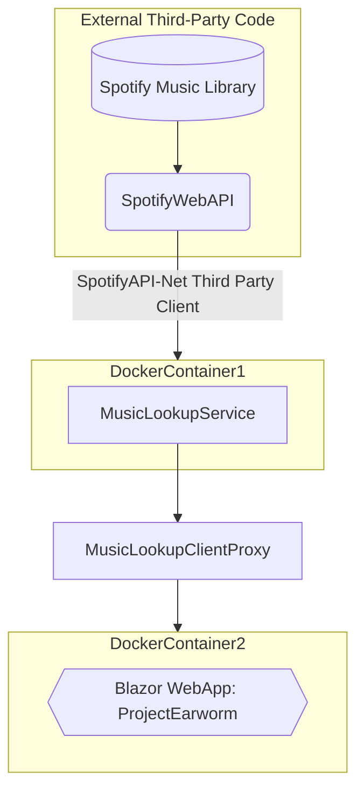

# Course_Project_Earworm
Project Earworm is a music lookup web app. It utilizes the SpotifyWebAPI. It consistes of a backend web service written in .NET 5 and a frontend blazor app that uses a client proxy written in .NET 8. The Web app and web servie run in docker.
NOTE: UI and websrvice must be running on local docker. webservice must be on port 5000. I wanted to make this configurable, but I ran out of time.
Docker images can be found here:
    General: https://hub.docker.com/repositories/trevorhowat
    Webservice: https://hub.docker.com/repository/docker/trevorhowat/music_lookup_service/general
    UI: https://hub.docker.com/repository/docker/trevorhowat/project_earworm/general

